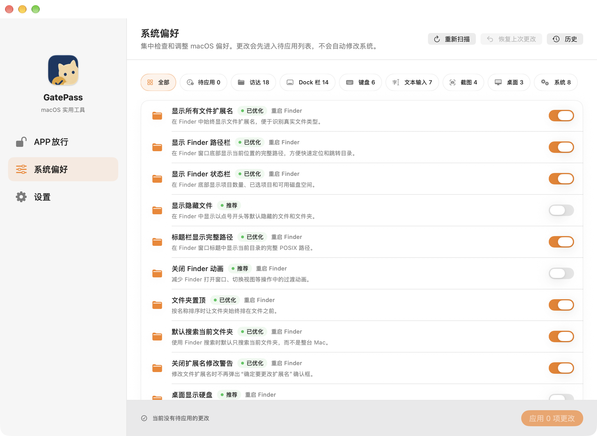

# GatePass

**让你信任的本地 Mac App 可以运行，并用明确、可恢复的流程调整 macOS 偏好。**

[English](README.md)

[](https://github.com/iPotatow/GatePass/actions/workflows/build.yml)
[](https://www.apple.com/macos/)
[](LICENSE)

GatePass 是一款原生 SwiftUI 工具，面向了解系统安全影响的高级 Mac 用户。它把通常散落在命令行里的两类工作集中到一个本地流程中：为已确认可信的 App 移除下载隔离属性，以及在写入前检查、应用并恢复一组经过筛选的 macOS 系统偏好。

## GatePass 能做什么

| 工作区 | 用途 |
| --- | --- |
| **App 放行** | 查找近期安装的 App，为可信的 `.app` 移除 `com.apple.quarantine`，并查看只读的 Gatekeeper 评估状态。 |
| **系统偏好** | 查看 60 项经过筛选的 macOS 偏好，先暂存更改，逐项验证写入结果，并恢复 GatePass 修改过的值。 |

### App 放行

- 扫描 `/Applications` 和当前用户的 `Applications` 文件夹，找出最近七天安装的 App。
- 显示 App 图标、名称和安装日期。可以将 App 拖到放行区域，也可以通过文件选择器选择一个或多个 `.app` 应用包。
- 只移除 `com.apple.quarantine` 属性。一次处理一个 App 时，可在操作完成后按设置自动启动它。
- App 激活时自动刷新列表，也支持手动刷新。
- 显示 Gatekeeper 评估是否启用，但不会修改系统的全局安全策略。


### 系统偏好

- 读取一份带类型的精选目录，覆盖 Finder、Dock、桌面、截图、键盘、文本输入、鼠标、存储、“信息”、“音乐”、“终端”和菜单栏等组件。
- 按系统组件筛选偏好，也可以只查看当前等待应用的项目。
- 所有开关都会先进入待应用草稿；只有选择**应用**后才会写入系统。
- 通过 `/usr/bin/defaults` 按类型读写，并在每次写入后重新读取，确认结果与目标一致。
- 如果扫描后系统值已经发生变化，GatePass 不会覆盖它；不支持或受权限限制的项目会明确标记，不会猜测处理。
- 将原始值保存到本地恢复记录，提供**恢复上次更改**，并在历史中保留最近 200 次操作结果。
- 标注更改后可能需要重启的相关进程。行为不确定的偏好不会进入自动推荐。



> [!WARNING]
> GatePass 可能降低系统保护或改变系统行为。只处理来源和完整性已经由你独立核验的 App。移除隔离属性**不能**证明 App 安全；调整系统偏好也不能替代安全审查。应用前请逐项检查所有待应用更改。

## 获取 GatePass

从 [GitHub Releases](https://github.com/iPotatow/GatePass/releases) 下载最新 ZIP 或 DMG。`0.2.0` 是首个包含“系统偏好”工作区的版本。

每个自动发布版本包含：

- `GatePass.zip`，用于安装和 App 内更新。
- `GatePass-<版本号>.dmg`，用于首次安装和手动更新。
- `SHA256SUMS`，用于完整性校验。

当 [`VERSION`](VERSION) 在 `main` 分支发生变化，或推送匹配的版本 Tag（例如 `v0.2.0`）时，发布工作流会构建并发布版本。只修改代码的普通推送不会发布 Release。DMG 还包含一个可选的解除隔离辅助脚本；只有在核验 App 来源后才应使用它。

## 快速开始

1. 将 `GatePass.app` 安装到 `/Applications` 或 `~/Applications`。
2. 打开**App 放行**，检查近期 App 列表，只处理你确认可信的 App。
3. 如需调整 macOS 偏好，打开**系统偏好**，检查待应用开关后选择**应用**。
4. 如果要撤销 GatePass 记录的值，选择**恢复上次更改**。

## 本地构建

要求：macOS 13 或更高版本，以及完整 Xcode。仅安装 Command Line Tools 无法构建本项目。

```bash
git clone https://github.com/iPotatow/GatePass.git
cd GatePass
xcodebuild \
  -project GatePass.xcodeproj \
  -scheme "GatePass - Release" \
  -configuration Release \
  build
```

本地调试构建并启动可使用 `./script/build_and_run.sh`。如需手动生成 DMG，请先用 Homebrew 安装 `create-dmg`，再运行：

```bash
script/build_dmg.sh /path/to/GatePass.app <版本号> <发布目录>
```

## 项目结构

| 路径 | 说明 |
| --- | --- |
| `GatePass/` | SwiftUI 主应用、App 放行流程、Gatekeeper 状态和设置 |
| `GatePass/Features/SystemPreferences/` | 偏好目录、带类型 defaults 客户端、计划器、执行器、恢复和历史界面 |
| `Tests/` | 系统偏好回归测试和 macOS defaults 审计 |
| `VERSION` | 唯一发布版本号 |
| `.github/workflows/` | 发布打包和跨 macOS 版本的偏好检查 |
| `script/` | 本地构建、启动、DMG 打包和 DMG 背景辅助脚本 |

## 贡献

欢迎提交聚焦的问题和 Pull Request。提交前请构建 **GatePass - Release** scheme。修改系统偏好目录时，请同时补充回归覆盖，并保持写入后验证和恢复记录的安全保证。

## 许可证

GatePass 使用 [Apache License 2.0](LICENSE) 开源。
